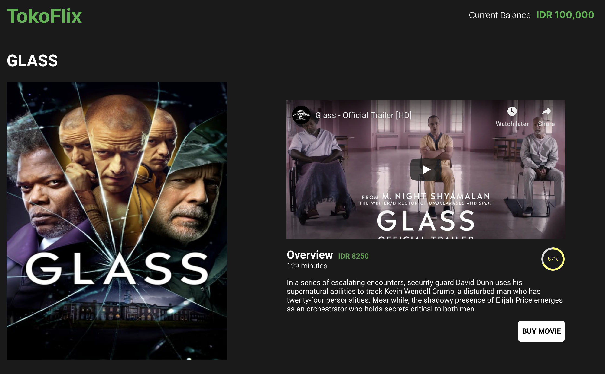

# TokoFlix

A project using themoviedb API and React.
Using Redux for State Management and styled0components for styling.

There are 2 versions.
Because the Now-Playing for Indonesian region is only one page so that I can't implement the pagination.
The solution is I use the US region for implementing pagination.

This project was bootstrapped with [Create React App](https://github.com/facebook/create-react-app).

## Running the Project

In the project directory, you can run:

### `npm start`

Runs the app in the development mode. 
Open [http://localhost:3000](http://localhost:3000) to view it in the browser.

The page will reload if you make edits. 
You will also see any lint errors in the console.

### `npm run build`

Builds the app for production to the `build` folder. 
It correctly bundles React in production mode and optimizes the build for the best performance.

## Via Docker

`docker build -t toko-flix .`  
`docker run -p 3000:3000 toko-flix`

## Screenshots

